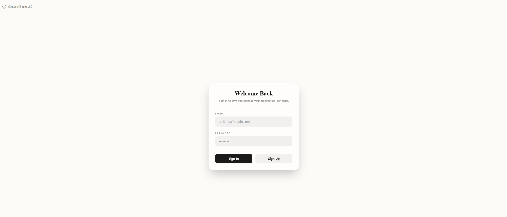
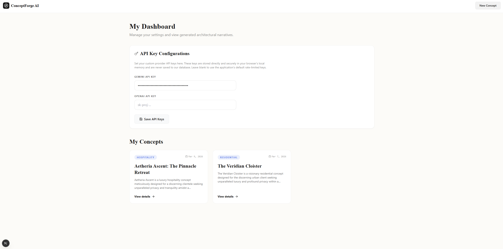

# ConceptForge AI

An AI-powered architectural concept ideation tool built with Next.js 15, Supabase, Tailwind CSS, and the Google Gemini / OpenAI APIs.

ConceptForge AI transforms project constraints (site area, location, client priorities, design style) into visionary architectural narratives. It acts as an early-stage ideation engine for architects and designers to rapidly synthesize contextual data and philosophical direction.

## 📸 Screenshots

### Landing Page


### User Onboarding & Auth


### Concept Generator Form


### Dashboard & History


### Results Output & Export


## ✨ Features

**🔐 Secure Authentication & Storage**
- Complete auth flow (Sign up, login, session management) powered by Supabase Auth
- Concepts are securely saved to a cloud PostgreSQL database
- View your entire architectural concept history on your personal Dashboard

**🧠 Dual AI Engine**
- Seamlessly toggle between Google's Gemini and OpenAI
- Supports `gemini-2.5-flash` and `gpt-4o-mini`

**🏗️ Structured Synthesis**
- Guarantees standardized layouts using strict LLM schemas
- Generates concept overviews, philosophies, material palettes, and zoning breakdowns

**🔑 LocalStorage BYOK (Bring Your Own Key)**
- Securely provide your own API key to bypass rate limits
- Keys are saved locally in your browser's memory and are *never* stored in our database

**📄 One-Click PDF Exports**
- Generate cleanly formatted PDF reports of your architectural concepts
- Powered by `jsPDF` for instant downloads

**🛡️ Intelligent Error Handling**
- Gracefully intercepts API quota and invalidation errors
- Displays clean UI feedback instead of raw JSON stack traces

**✨ Premium UI/UX**
- Built on Next.js 15 App Router
- A buttery-smooth, highly aesthetic interface crafted with Tailwind CSS and Framer Motion

## 🚀 Getting Started

### Prerequisites
- Node.js 18+
- npm or pnpm
- API Keys from [Google AI Studio](https://aistudio.google.com/) or [OpenAI](https://platform.openai.com/) (Optional if you use the BYOK UI)

### Installation

1. Clone the repository
```bash
git clone https://github.com/hurairahmateen/conceptforge-ai.git
cd conceptforge-ai
```

2. Install dependencies
```bash
npm install
```

3. Configure Environment Variables
Copy the example environment file to create your local environment instance:
```bash
cp .env.example .env.local
```
Then open `.env.local` and fill in your keys:
```env
# Required for Auth & Database
NEXT_PUBLIC_SUPABASE_URL="https://your-project-id.supabase.co"
NEXT_PUBLIC_SUPABASE_ANON_KEY="your-anon-key-here"

# Optional (Defaults for the AI Generation)
GEMINI_API_KEY="your_gemini_key_here"
OPENAI_API_KEY="your_openai_key_here"
```

4. Start the Development Server
```bash
npm run dev
```
Open [http://localhost:3000](http://localhost:3000) with your browser to see the result.


