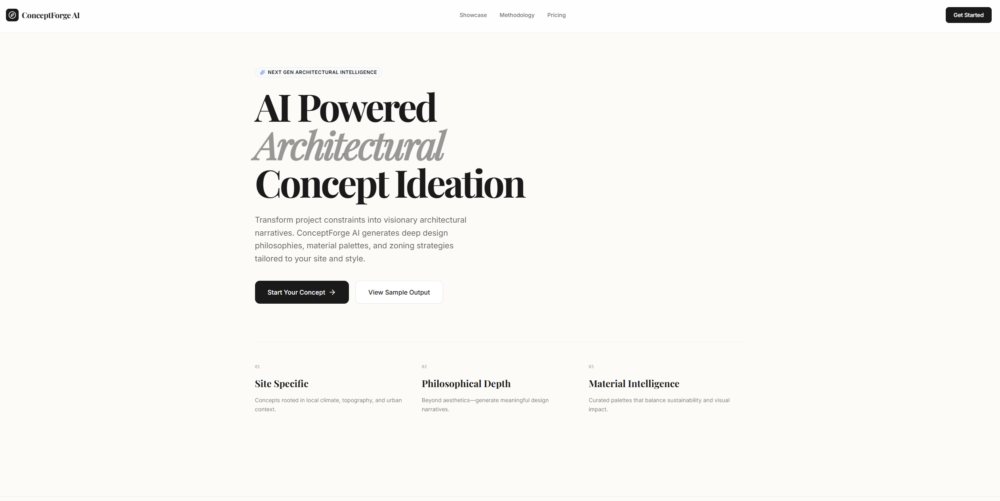
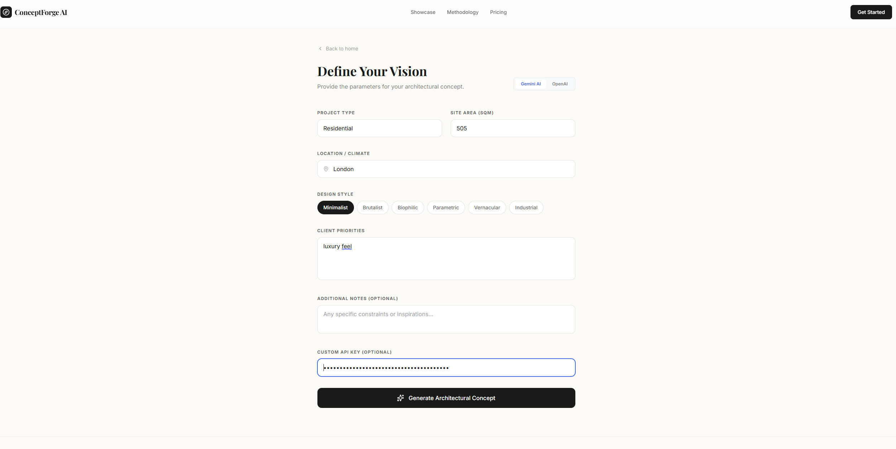
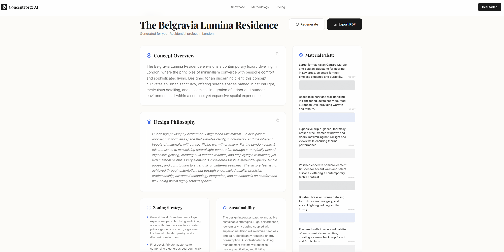

# ConceptForge AI

An AI-powered architectural concept ideation tool built with Next.js 14, Tailwind CSS, and the Google Gemini / OpenAI APIs.

ConceptForge AI transforms project constraints (site area, location, client priorities, design style) into visionary architectural narratives. It acts as an early-stage ideation engine for architects and designers to rapidly synthesize contextual data and philosophical direction.

## 📸 Screenshots

### Landing Page


### Concept Generator Form


### Results Output & Export


## ✨ Features

**🧠 Dual AI Engine**
- Seamlessly toggle between Google's Gemini and OpenAI
- Supports `gemini-2.5-flash` and `gpt-4o-mini`

**🏗️ Structured Synthesis**
- Guarantees standardized layouts using strict LLM schemas
- Generates concept overviews, philosophies, material palettes, and zoning breakdowns

**🔑 Bring Your Own Key (BYOK)**
- Securely provide your own API key directly from the browser
- Handled safely via Next.js Server Actions 

**📄 One-Click PDF Exports**
- Generate cleanly formatted PDF reports of your architectural concepts
- Powered by `jsPDF` for instant downloads

**🛡️ Intelligent Error Handling**
- Gracefully intercepts API quota and invalidation errors
- Displays clean UI feedback instead of raw JSON stack traces

**✨ Premium UI/UX**
- A buttery-smooth, highly aesthetic interface
- Crafted with Tailwind CSS and Framer Motion

## 🚀 Getting Started

### Prerequisites
- Node.js 18+
- npm or pnpm
- API Keys from [Google AI Studio](https://aistudio.google.com/) or [OpenAI](https://platform.openai.com/) (Optional if you use the BYOK UI)

### Installation

1. Clone the repository
```bash
git clone https://github.com/hurairahmateen/conceptforge-ai.git
cd conceptforge-ai
```

2. Install dependencies
```bash
npm install
```

3. Configure Environment Variables
Copy the example environment file and add your default API keys (if you want to bypass the BYOK frontend).
```bash
cp .env.example .env.local
```
Then fill in `.env.local`:
```env
GEMINI_API_KEY="your_gemini_key_here"
OPENAI_API_KEY="your_openai_key_here"
```

4. Start the Development Server
```bash
npm run dev
```
Open [http://localhost:3000](http://localhost:3000) with your browser to see the result.


